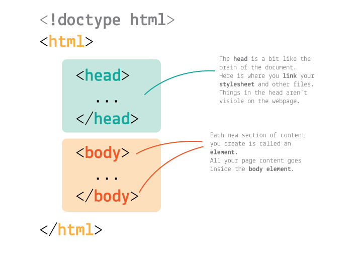

# Coding for the web


* Welcome & introductions
* [The plan for this course](#what-is-the-plan)
* [What is code?](#what-is-code)
* [Key concepts](#key-concepts): Content, Design, User experience
* [Your project brief](#your-brief)
* [Workshop](#lets-code): HTML & CSS

## Welcome! 

If you're reading this then you've already managed the hard part.


This course is a laid back introduction to web development and coding. We are here to understand the basics of how websites are built have some fun with them.


### When is lunch?

Research shows that people focus much better when they know what time they're going to eat...

So `lunch <br>` will be at around **12:30pm** for 1 hour.

We aim to wrap up by **4pm**.

### Two words about myself

 I'm a Third year Web Media student at Ravensbourne. I work as a freelance web developer and I'm really passionate that everyone should get creative online. I will aim to demystify *jargon*, and relay technical stuff into laymans terms concerning the web. 

**I'm not a computer scientist**, I learnt to code by myself through experimenting and tinkering.

I was recently in your shoes and want to show you that it's easy to get started and anyone can give it a go!

### Introduce each other

This course will be **informal** and relaxed, so if you have any questions at any time just ask. 

We'd like you to introduce yourself to your neighbour. Then we'll ask you to introduce each other to the rest of the group.

* A bit about yourself
* How did you hear about this course?
* Why are you on this course?


This course is about getting **creative** with **code**.

Getting familiar with how coders work day to day, and experiencing the **design and development process** first-hand. How to take an idea from zero to working prototype.

For many of you, this will be a **memorable day**. You'll write your first code using **HTML**, **CSS**, 

It's going to be **challenging** and we want to make sure that you also have **fun**!

I will try not to talk at you too much, but to work with help each other.


### GitHub

All the course material is on GitHub :octocat:
[**https://github.com/03difoha/1-day-coding**](https://github.com/03difoha/1-day-coding)

Including notes from todays session, exercises, sample code, presentations and links to learn more!


# What is the plan?

When	| What
---	| ----
(10am) | Content: What forms of media are online? Find content to use for our sites.
(11am) | Coding with **HTML**.
(12am) | Get stylish with **CSS**
(1pm) | Lunch Time
(2pm) | User experience design
(3pm) | Debugging, finishing touches and further reading.
(4pm) |Home time!


# Content: What forms of media are online?

How many types of content can you think of that you have seen on a website?


* Text
* Images
* Video
* Audio


All these elements can be used to create different websites:

* Text = online cv
* Images = photo gallery
* Text + Images = online newspaper
* Video + Text = blog
* Text + Audio = online poetry

Have a think about what kind of website you want to make. To get inspired think about

* Your hobbies i.e. a website with information about premier league teams, or the history of cycling etc..
* Do you have content your have created yourself? i.e. photos?, poetry?, graphic designs? CV information?
* are you creative? tell a story with images, text and sounds you find online.

Spend the next 20 minutes gathering at least three types of content for your site.
If you aren't sure what to do, just pick some interesting text and images for now and you can change them after.

###Content Resources

* Text: [Public Poetry](http://www.public-domain-poetry.com/)
* Cool Images: [unsplash.com](https://unsplash.com/) 
* Free Video:[archive](https://archive.org/details/movies)
* Stock free Music [Purple Planet](http://www.purple-planet.com/jazz/4583971402), [soundcloud](https://soundcloud.com/purpleplanetmusic)


#Coding
### Now we have some content for our site, lets discuss how to put it on the page.

firstly what *is* Code?

Can you give me some examples?

#### [...] code

*Morse code*, *post code*, *dress code*, •genetic code*, *highway code*...

What do you think all of these have in common with each other?

Code existed **before computers**.

Code is about

* transmitting information
* giving instructions
* **communication**

If I want to communicate with **someone** that doesn't speak English, I will need to learn a language that they can understand. To communicate with you, I use English.

To **talk to a computer**, we need to speak code (HTML + CSS)

Code is **instructions** to a computer: extremely powerful yet fundamentally *thick*.

### How do you learn to code?

* **Translating** your ideas into a language your computer understands

* **Observing** how the computer responds to your inputs and adapting them until it works

**Today** you're going to learn **2 new languages**: HTML and CSS.


## Key concepts recap

### Content

This is the information that you find on a website. Content can come in many forms such as text, images, video and audio.

Good content is informative, interesting and concise. 


# Your brief

### Make a **website** that has interesting, concise content and is designed to be user friendly.

**The *who/what* is up to you**. You could create a portfolio for yourself, a photography album, a online CV or even a page of recipes for your favorite food.

# Let's code

A few **tips** before we start coding:

* You don't need to understand everything right away, it will slowly make more and more sense as you look at it over time.

* You don't have to bust your brain to remember everything either!

* If you're not sure how to do something, get into the practice of *googling* it! All the answers are out there. Being able to find them is a real skill that all coders continue to hone.

* Good coders don't type - always **copy-paste** where possible!

### Copy

Mac <kbd>cmd</kbd> + <kbd>c</kbd>

PC <kbd>ctrl</kbd> + <kbd>c</kbd>

### Cut & copy

Mac <kbd>cmd</kbd> + <kbd>x</kbd>

PC <kbd>ctrl</kbd> + <kbd>x</kbd>

Very useful when you want to **move** one block of code from one place to another.

### Paste

Mac <kbd>cmd</kbd> + <kbd>v</kbd>

PC <kbd>ctrl</kbd> + <kbd>v</kbd>

## HTML & CSS crash course

We're going to learn how to:

* Write HTML to **structure** your app interface
	* Create several types of **text** (paragraphs, headings)
	* Create **inputs** (dropdowns, buttons, text boxes)
	* Create **links** to other Web pages
	* Add **images**

* Write CSS to **style** your Website
	* Design your app **typography**
	* Set your app **colours**
	* **Search** for code online and integrate what you find in your project (that's what coders do most of the time!)

## Step by step

> Go to [thimble.mozilla.org](https://thimble.mozilla.org/) and log in with these details:
> * Email: `1daycode`
> * Password: `1D4yc0d3`

> Then click on `Start a project from scratch`.

> Change the name of your project to **your name**. For now, everyone's projects will be stored in one account.

### Content first, style later!

It's good practice to build the **HTML** first, and then make it _stylish_ with CSS.

#### HTML basics

HTML is a *markup* language, which you use to *format your content*.

Essentially, you wrap content inside bits of code called tags.

`<tag> content </tag>`

The bits of code inside angle brackets `<` and `>` are instructions for the computer:

* They describe the content they wrap
* Define where it starts `<tag>`
* Define where it ends `</tag>`

For example, this is how you wrap a paragraph of text in `p` tags:

`<p> This is a paragraph. </p>`

`p` stands for *paragraph*, of course.

#### HTML skeleton

Thimble created an HTML skeleton for you, containing the basic **building blocks**: `html`, `head` and `body` tags.

Every HTML document, at the bare bones, needs to have this structure.

<!--
```html
<!doctype html>
<html>
	<head>
		...
	</head>
	<body>
		...
	</body>
</html>
```
-->



#### Head

> In the `head` edit your app `title` by changing the text in between the `<title> ... </title>` tags.

What you put in the `head` is not visible to the user.

Later, you'll add links to external resources like *stylesheets* and *meta* information.

#### Body

In the `body` you will put all the **interface elements** that are visible to the user.


## Let's start building

#### Sections

> Inside the `body`, add in three `<section>` elements

```html
<body>
	<section></section>
	<section></section>
	<section></section>
</body>
```

#### Headings


> Inside the first `section`, add a **heading** `h1` and a **sub-heading** `h2`. These will be the most important pieces of information of your Website's main page.

> ```html
<section>
	...
	<h1>Your Website name</h2>
	<h2>What it's for</h2>
</section>
```

#### Paragraphs

> Write a paragraph to explain how your website works, and what you want people to do first.  

> ```html
<section>
	...
	<p>Swap skills and time with people in your community!</p>
  	<p>Just choose an activity to get started.</p>
</section>
```

`p` is for *paragraph*


#### Hyperlinks


You can add **hyperlinks** to our content using the `a` element.

```html
<a href="http://example.com"> the clickable text </a>
```

`a` is for *anchor* :anchor:

> Add in a little credit at the bottom of your page, just above the closing `</body>` tag.

> ```html
	...
	<p>Made with love by <a href="http://example.com"> Your Name</a></p>
</body>
```

#### Fancy logo


It's important. We recommend [hipsterlogogenerator.com](https://www.hipsterlogogenerator.com) for quick and easy hipster logos :)

> Take a couple of minutes to quickly make your own fancy logo.

> To place your logo in your HTML document create an `img` element inside the first `section`. `img` elements don't need closing tags (it's one of the exceptions to the general rule of closing tags).

> ```html
<section>
	
</section>
<section>
...
</section>
```

Every `img` requires a link - either a weblink to the image or the location of the image you're using in your files.

> In Thimble, upload your logo and put the name inside `src=" "`

> ```html
<section>
	
</section>
<section>
...
</section>
```

If you're taking an image from the web you need to use the link to the image alone.

> Right-click on the image and `Copy Link Address`. Then paste it inside `src=" "`

> ```html
<section>
	
</section>
<section>
...
</section>
```

Don't worry just now if it's too big, we'll resize it later on.


### Publish your project

> Now click `Publish` to see how your app looks so far. :+1:

# Styling

Now the stylish part: **CSS**!

There's a `link` in the `head` of your app which points to a CSS file called **style.css**. This is where you add your own styles.

```html
<link rel="stylesheet" href="css/style.css">
```

You can have more than just one CSS file, and we'll show you how it's good practice to work on several small files rather than one long document you may get lost into.


#### CSS basics

You use CSS to style HTML.

CSS looks and works differently than HTML.

```css
selector
{
	property: value;
	property: value;
}
```

The part before the curly brackets `{` and `}` is the **selector**. This ***selects* the element** from your HTML document.

In CSS you can select multiple HTML elements in one go.

For example, to select all paragraphs you can write

```css
p
{
	/* your styles for paragraph here */
}
```

CSS **properties** define how HTML elements are displayed.


The first bit is the property name, eg `color`, and the second bit is the value, eg `green`. They are separated by a `:` colon, and you MUST end each line of CSS with a `;` semicolon (for real, otherwise your browser will choke).

For example ...

```css
p
{
	color: green;
}
```

... will turn *every* paragraph in your HTML green.

#### Play around a bit

> Let's spend the next 5-10 minutes getting familiar with CSS. It doesn't matter if your website looks a bit funny for now. Things you can do:

> * change the `color` of your `h1` or `h2` elements
> * align some elements to the `center` (*google* how to do it)
> * hide some elements
> * change the `background-color` of the whole page

> What else would you like to do? Try and *google* it first, then we can do it together (if it's not too whacky).

#### Search for solutions!

Part of learning to code and being a coder is searching for answers, every day. You don't need to remember everything and you don't need to learn everything immediately.

**All the answers can be found on the Web! As coders, we must get used to searching online for solutions.**

#### Inspect websites you like

Did you know, you can see the code which has created every site on the Web? You can use the **Web Inspector** to do this. It's like x-ray specs for websites.

> Go to a website (any website) and right-click anywhere on that page, then select `Inspect` (or `Inspect Element` in some browsers).

On the **left panel** of the `Elements` tab you can see all the HTML code for the page you're inspecting. By clicking on an HTML element you'll reveal all the CSS applied to it, on the **right panel**.

You can also play with this code and change the way your favourite websites look (but don't worry, your changes won't affect how other people are experiencing that site). :scream:

> Go to a site you like, right-click > `Inspect` and then see if you can find which colours it uses.

#### Fonts

Text is the major carrier of information on an website, so it's good practice to start with **typography**, or *type setting*. That means defining how texts are going to look, which fonts your website is going to use, and the proportions between them in your website layout.

> You can grab a free **font** from [Google Fonts](https://fonts.google.com/):

> 1. Pick a typeface you like
> * Click on the red `+` button (in the top right corner of the selected font)
> * Toggle the `family selected` box (black bar at the bottom)
> * Copy and paste the `embed code` into your Thimble (between your <head> tags)

>	Where? Before `style.css`

>	```html
	<head>
		...
		<link href='https://fonts.googleapis.com/css?family=Lato:400,300,700,900' rel='stylesheet' type='text/css'>
		<link rel="stylesheet" href="css/style.css">
	</head>
	```
> * In `style.css`, define the font for the `body` element (all other elements will inherit it).

>	```css
body
{
	font-family: 'Lato', sans-serif;
}
```

We're using the font *Lato* as an example, but you can pick **whichever font** you like and change your CSS code accordingly. There are more than 700 fonts available on Google Fonts!

Then you can set **more specific rules** for headings, paragraphs and bold elements. For instance, you could use a different font just for headings, as well as changing many other aspects of your typography:

* `font-family`
* `font-size`
* `font-weight`
* `font-style`
* `line-height`
* `letter-spacing`
* `word-spacing`
* `text-align`
* `text-decoration`
* `text-transform`
* `text-indent`

> `font-family`, `font-size` and `color` are a great place to start!

#### Background images

You can add images to your app via CSS. This is useful if you want to set different images for different screen sizes (eg: one for mobile, a different one for tablets) as well as fine-tuning how your images should display.

> In your `style.css` create a new `background-image` rule for `html`

> ```css
html
{
	background-image: url('');
}
```

You can upload your own image files to Thimble (if they're smaller than 3MB), or use image links from the Web (provided they're licensed for re-use).

For now, we'll use [03difoha.github.io](https://03difoha.github.io), where you can find beautiful, high-res pictures that are free to use for *whatever* purpose you want. Amazing!

> 1. Find an image you like on [03difoha.github.io](https://03difoha.github.io)
> * Secondary click on the image. (Right click for PC, Two finger click for Mac)
> * **Copy Image Address**. This should copy the images URL to your clipboard. Paste it into a new tab if you don't believe me.
> * **Paste** it in your `style.css` inside the `body` `background-image` rule like so

> ```css
html
{
	background-image: url('https://03difoha.github.io/example.jpg');
}
```

By default background-images *tile*, but we want them to take up the whole available screen space, without losing their aspect ratio (no squashing). 

We can achieve that with `background-size`. This property can take various values: pixel sizes, percentages, and then a couple of interesting keywords.

* `contain` will scale the image so as to be as large as possible providing that it is **contained** within the background positioning area. 
* `cover` instead, will scale the image, this time to be as large as possible so that the background positioning area is completely **covered** by the background image.

> Add `background-size: cover;` to the `html` rule.

> ```css
html
{
	background-image: url('https://03difoha.github.io/example.jpg');
 	background-size: cover;
}
```

Now the image *covers* the content of your app, ie the `body` but you have probably noticed that it doesn't cover the *whole browser window*. The last touch we can add to the background image, to make it cover the whole browser window is adding `background-attachment: fixed;`

> ```css
html
{
	background-image: url('https://03difoha.github.io/example.jpg');
 	background-size: cover;
 	background-attachment: fixed;
}
```  


* Introduce **Web Inspector**, HTML and CSS tabs.


* CSS **comments**

* Style `select` and `button`
	* `border: none;`
	* `border-radius`
	* `margin`
	* `padding`
* Colours
	* Web inspector colour picker (maybe pick a colour from Facebook). Everything is lost on *page refresh* so need to copy-paste into our code.
	* `background`
	* `color`
	* `border-color`
	* Check out [Kuler](https://color.adobe.com) and/or [Flat UI colors](https://flatuicolors.com/) for inspirations
 

### Final touches

* Media queries

	```css
	/* if the screen is larger than 600px..  */
	@media (min-width: 600px) {
	  body {
	    max-width: 600px;
	    margin: auto;
	    font-size: 1em;
	  }
	}
	```
* Icons using [FontAwesome](https://fortawesome.github.io/Font-Awesome/)

	```css
	.dropdown
	{
	  position: relative;
	}
	.dropdown:after
	{
	  content: "\f063";
	  font-family: FontAwesome;
	  position: absolute;
	  top: .75em;
	  right: .75em;
	  font-size: 2em;
	  pointer-events: none;
	}
	```

* Make the app look proper on a phone. Google `how to stop phone zooming out pages`

* Make the app **full screen**. Google `how to hide address bar in mobile browser` and you should find [this tutorial](http://www.html5rocks.com/en/mobile/fullscreen/)

* Add the app to your phone's **home screen**

	`<link rel="apple-touch-icon" href="blabla.png">`

* Transparency?

* Take inspiration from these fancy demos by Codrops:
	* [Custom select elements](http://tympanus.net/codrops/2014/07/10/inspiration-for-custom-select-elements/)
	* [Minimal form interface](http://tympanus.net/codrops/2014/04/01/minimal-form-interface)
	* [Natural language form](http://tympanus.net/codrops/2013/05/21/natural-language-form-with-custom-input-elements)


<!--
### License

[](http://creativecommons.org/licenses/by-nc-sa/4.0)

This work is licensed under a [Creative Commons Attribution-NonCommercial-ShareAlike 4.0 International License ](http://creativecommons.org/licenses/by-nc-sa/4.0)
-->
